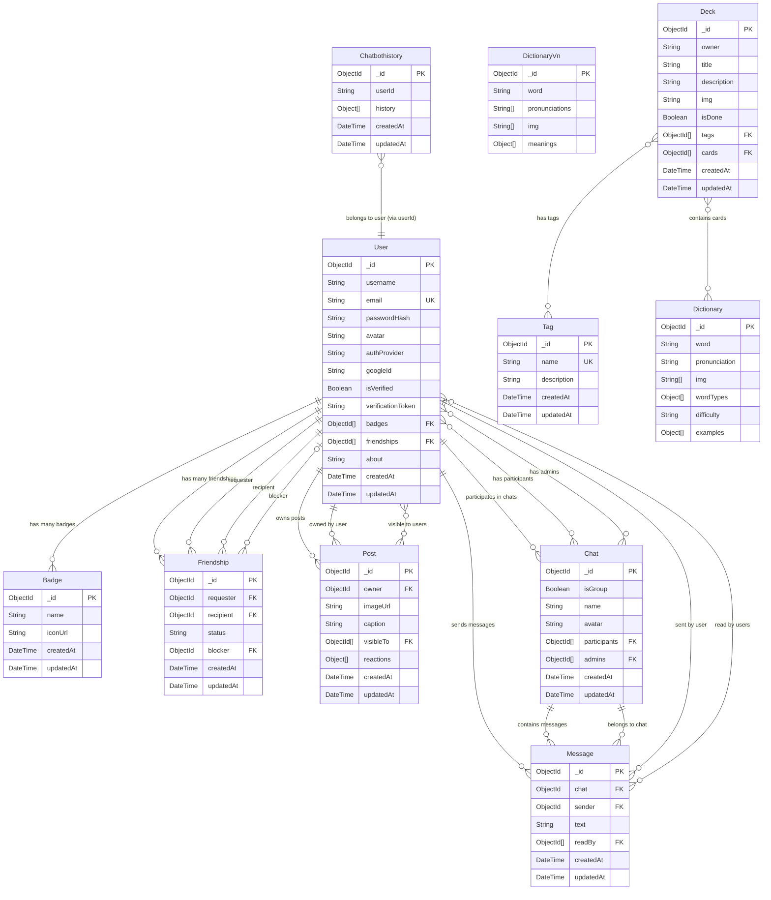

# Lacquer 🇻🇳
Ever looked at a bowl of phở and thought “damn, I wish I knew what’s goin on”?

Boom. **Lacquer**.

Learn Vietnamese and English, flex AI that recognizes food, landmarks, and weird-ass cultural stuff just by pointing your camera.

Snap. Post. React. Chat. Add friends.

It’s Duolingo but make it ✨social media✨ with Vietnamese spice.

You even earn badges for being outside. Like Pokémon GO but for heritage 😭

Download it before Gen Alpha starts gatekeeping Vietnamese culture =)))
## Tech Stack

- **Frontend:** [Flutter](https://flutter.dev)  
- **Backend:** [Express.js](https://expressjs.com)  
- **Auth:** [Google OAuth 2.0](https://developers.google.com/identity)  
- **Database:** [MongoDB + Mongoose](https://mongoosejs.com)  
- **Image Hosting:** [Cloudinary](https://cloudinary.com)  
- **AI/ML:** [Google Gemini](https://deepmind.google/technologies/gemini/)  
- **NLP & Vision:**  
  - [Google Translate API](https://cloud.google.com/translate)  
  - [Google Vision API](https://cloud.google.com/vision)  
- **Deployment:** [Railway](https://railway.app)

## Features

- 🧠 AI-assisted translations and image recognition  
- 🔐 Google login with OAuth  
- 🗣 Dictionary with pronunciation + image support  
- 💬 Real-time chat (DMs + groups)  
- 📸 Social posts with emoji reactions  
- 📚 Flashcard decks for vocab learning  
- 🏆 Achievement badges  
- 🤝 Friend system (request, accept, block)

## 🗃 Database Schema

